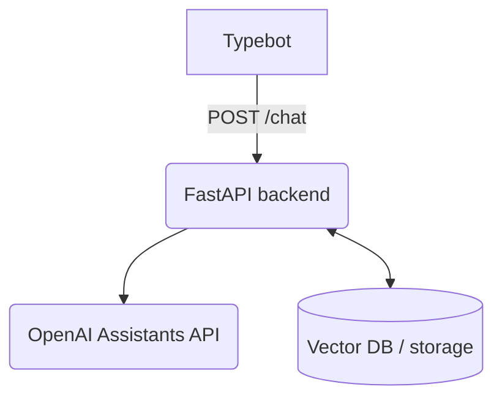

- **Typebot**: frontend chatbot that sends user messages.
- **FastAPI backend**: receives chat requests and orchestrates responses.
- **OpenAI Assistants API**: TODO – integrate for generating replies.
- **Vector DB / storage**: TODO – persist conversation context or embeddings.

