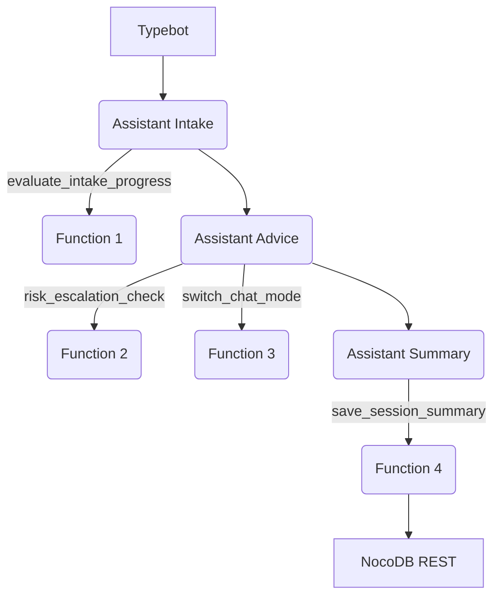

The monolithic FastAPI layer was removed. Each tool is now an Azure Function
invoked directly by the OpenAI Assistant runtime. They share small utilities
for OpenAI and NocoDB access but otherwise run independently.
